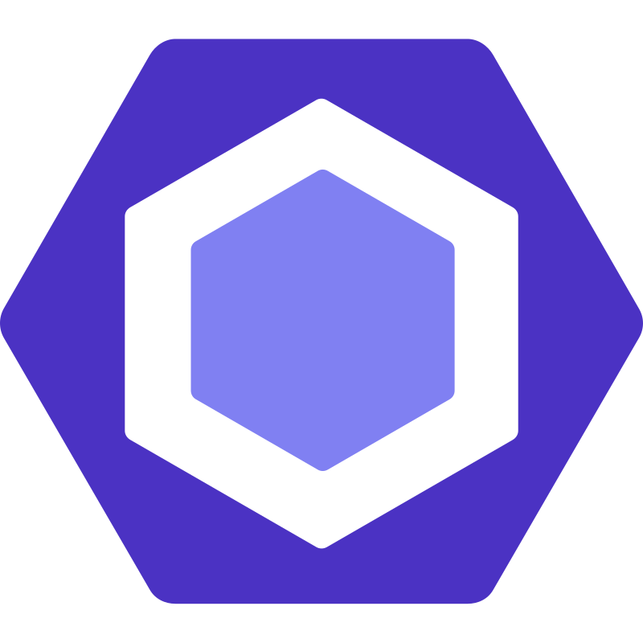

<h1 align="center">Hello, I'm Suryansh Upadhyay 👋</h1>
<h2 align="center">Full-Stack Developer | Competitive Programmer </h2>

- 🌱 I'm currently learning **Cloud Computing**

- 🔭 I’m currently working on **MERN Stack Development**
  
- 👯 I’m looking to collaborate on **Open Sources and Hackathons**

- 💬 Ask me about **DSA and Full Stack Development**

<h3 align="left">Connect with me:</h3>

<h3 align="left">Languages and Tools:</h3>

                    
 

<h3 align="left">Github Stats : </h3>

